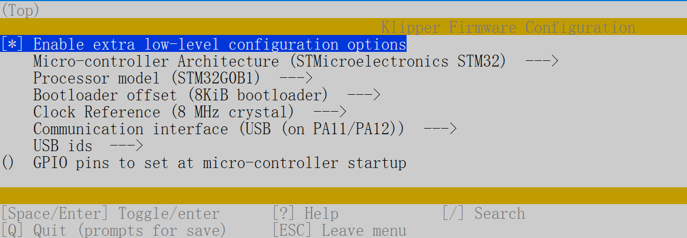
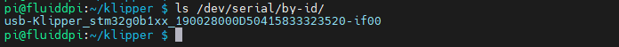

# [切换到中文版](./README_zh_cn.md)

# How to use Klipper on Manta M4P

## NOTE: 

- This motherboard comes with a bootloader that allows firmware updates via the MCU SD card.

## Build Firmware Image

1. **Precompiled firmware** (The source code version used is [Commits on Jul 1, 2022](https://github.com/Klipper3d/klipper/commit/1636a9759bc2d5f162312ac8bf5823e95e0ad053))
   - [firmware-USB.bin](./firmware-USB.bin) - Use USB to communicate with SoC. The USB of MCU on M4P has been connected with CB1/CM4 on the board. After updating the firmware, it can be used without additional wiring.

2. **Build your own firmware**
   1. Refer to [Klipper's official installation](https://www.klipper3d.org/Installation.html) to download Klipper source code to the Raspberry Pi.
   2. Build the micro-controller with the configuration shown below. If your Klipper cannot select the following configuration, please update your Klipper source code.
      - [*] Enable extra low-level configuration options
      - Micro-controller Architecture = `STMicroelectronics STM32`
      - Processor model = `STM32G0B1`
      - Bootloader offset = `8KiB bootloader`
      - Clock Reference = `8 MHz crystal`
      - Communication interface = `USB (on PA11/PA12)`

      

   3. Once the configuration is selected, press `q` to exit, and "Yes" when asked to save the configuration.
   4. Run the command `make`.
   5. The `klipper.bin` file will be generated in the folder `home/pi/klipper/out` when the `make` command is completed. You can use a Windows computer on the same LAN as the Raspberry Pi to copy `klipper.bin` from the Raspberry Pi to the computer with the `pscp` command in the CMD terminal, such as `pscp -C pi@192.168.0.101:/home/pi/klipper/out/klipper.bin c:\klipper.bin`. The terminal may prompt that the server's host key is not cached and ask "Store key in cache? (y/n)." Please type `y` to store. It will then ask for a password; please type the default password `raspberry` for the Raspberry Pi.

## Firmware Installation

1. You can use the method in [Build Firmware Image 2.5](#build-firmware-image) or use a tool such as `Cyberduck` or `WinSCP` to copy the `klipper.bin` file from your Pi to your computer.
2. Rename the `firmware-USB.bin` or `klipper.bin` (in the folder `home/pi/klipper/out` built by yourself) to `firmware.bin`.
**Important:** If the file is not renamed, the bootloader will not be updated properly.
3. Copy the `firmware.bin` to the root directory of the MCU SD card (make sure the SD card is in FAT32 format).
4. Power off the motherboard.
5. Insert the MCU SD card.
6. Power on the motherboard.
7. After a few seconds, the motherboard should be flashed.
8. You can confirm that the flash was successful by running `ls /dev/serial/by-id`. If the flash was successful, this should now show a Klipper device, similar to:

   
   
## Configure Printer Parameters
### Basic Configuration

1. See [Klipper's official installation](https://www.klipper3d.org/Installation.html) for "Configuring OctoPrint to use Klipper."
2. See [Klipper's official installation](https://www.klipper3d.org/Installation.html) for "Configuring Klipper." And use the configuration file [generic-bigtreetech-manta-m4p.cfg](./generic-bigtreetech-manta-m4p.cfg) as the underlying `printer.cfg`, which contains all the correct pinout for Octopus.
3. Refer to [Klipper's official Config_Reference](https://www.klipper3d.org/Config_Reference.html) to configure the features you want.
4. If you are using USB to communicate with the Raspberry Pi, run `ls /dev/serial/by-id/*` on the Raspberry Pi to get the correct motherboard ID number and set the correct ID number in `printer.cfg`.
    ```
    [mcu]
    serial: /dev/serial/by-id/usb-Klipper_stm32g0b1xx_190028000D50415833323520-if00
    ```
